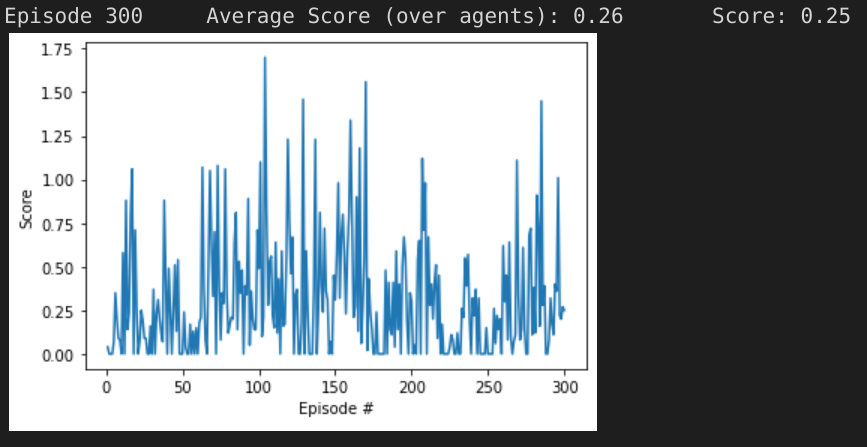
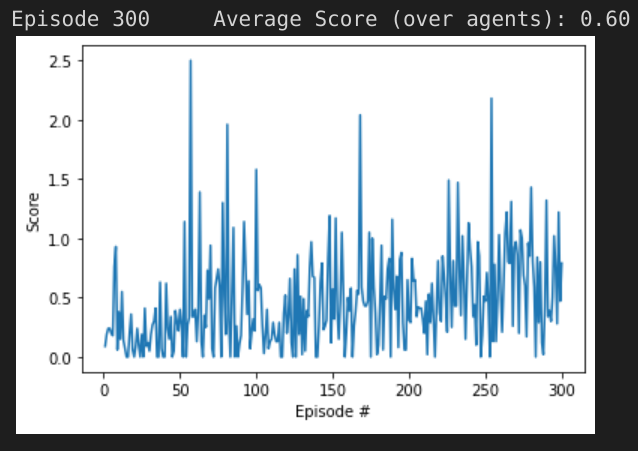

# Continous Control Project
This report describes results obtained in partial completion of the [Udacity Deep Reinforcement Learning Nanodegree](https://www.udacity.com/course/deep-reinforcement-learning-nanodegree--nd893) in implementing an agent to solve the [Reacher Unity ML Agents](https://github.com/Unity-Technologies/ml-agents/blob/master/docs/Learning-Environment-Examples.md#reacher) environment using deep reinforcement learning.
# Navigation Project Baseline
As suggested in the Continuous Control Project guidelines, the starting point for this work was the [DDPG Pendulum course exercise](https://github.com/udacity/deep-reinforcement-learning/tree/master/ddpg-pendulum) available on the Udacity Deep Reinforcement Learning repository on GitHub in which the [Open AI Gym Pendulum](https://gym.openai.com/envs/Pendulum-v0/) environment is trained. The Pendulum environment is very simple having a continous value action space size of 1 and a continuous value state space size of 3. This constrasts with the Reacher environment we wish to solve which has an action space of 4 and a state space of 33. The Actor and Critic models have two linear layers of 400 and 300 units.

After updating the Pendulum code to work with the Reacher environment and also providing for multiple agents a first run of 300 episodes shows that the agent has trouble learning in this more complex environment.

The following sections describe efforts to improve from this baseline performance.

# Increase in Model Size

A first exploratory step to improve learning is to adapt the model structure.  A cursory look at the [DDPG Bipedal course exercise](https://github.com/udacity/deep-reinforcement-learning/tree/master/ddpg-bipedal) in the Udacity Deep Reinforcement Learning repository on GitHub shows that a more complex model is needed to learn in a more complex environment.  Indeed, although the size of individual layers in the Bipedal model are individually smaller than for the Pendulum model (256 and 128 instead of 400 and 300), the Critic in the Bipedal model has a deeper architecture with three fully connected layers.

Results obtained here show that although there was some (very little) improvement, clearly there is some underlying issue that is preventing the agent from learning in both cases.

