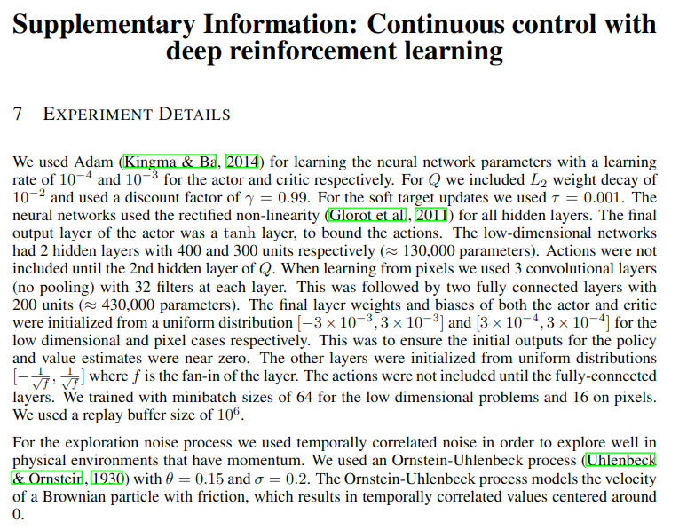
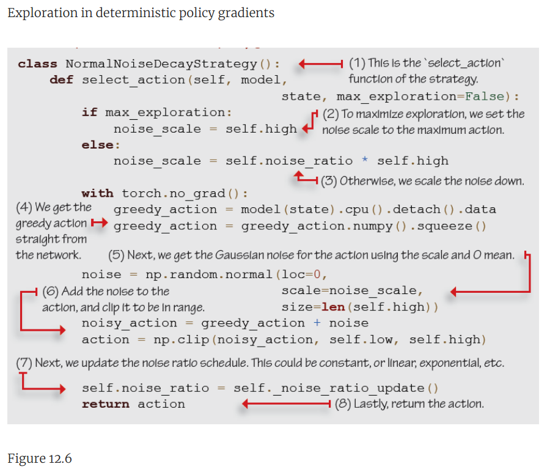
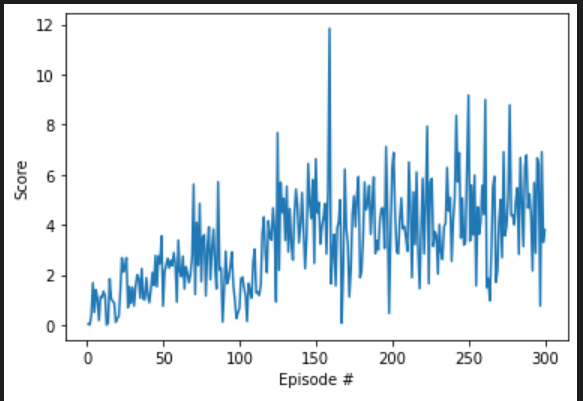

# Continous Control Project
This report describes results obtained in partial completion of the [Udacity Deep Reinforcement Learning Nanodegree](https://www.udacity.com/course/deep-reinforcement-learning-nanodegree--nd893) in implementing an agent to solve the [Reacher Unity ML Agents](https://github.com/Unity-Technologies/ml-agents/blob/master/docs/Learning-Environment-Examples.md#reacher) environment using deep reinforcement learning.
# Navigation Project Baseline
As suggested in the Continuous Control Project guidelines, the starting point for this work was the [DDPG Pendulum course exercise](https://github.com/udacity/deep-reinforcement-learning/tree/master/ddpg-pendulum) available on the Udacity Deep Reinforcement Learning repository on GitHub in which the [Open AI Gym Pendulum](https://gym.openai.com/envs/Pendulum-v0/) environment is trained. The Pendulum environment is very simple having a continous value action space size of 1 and a continuous value state space size of 3. This constrasts with the Reacher environment we wish to solve which has an action space of 4 and a state space of 33. The Actor and Critic models have two linear layers of 400 and 300 units.

After updating the Pendulum code to work with the Reacher environment and also providing for multiple agents a first run of 300 episodes shows that the agent has trouble learning in this more complex environment.

The following sections describe efforts to improve from this baseline performance.

# Increase in Model Size

A first exploratory step to improve learning is to adapt the model structure.  A cursory look at the [DDPG Bipedal course exercise](https://github.com/udacity/deep-reinforcement-learning/tree/master/ddpg-bipedal) in the Udacity Deep Reinforcement Learning repository on GitHub shows that a more complex model is needed to learn in a more complex environment.  Indeed, although the size of individual layers in the Bipedal model are individually smaller than for the Pendulum model (256 and 128 instead of 400 and 300), the Critic in the Bipedal model has a deeper architecture with three fully connected layers.

Although seemingly important, this turned out to have little effect on learning.

# Noise Decay

On the other hand, adding appropiate noise decay to the agent produced significant results raising confidence in being able to improve learning with further tuning.  In fact, section 7 of the [DDPG article](https://arxiv.org/abs/1509.02971) provides a wealth of detail on various hyper parameters, including the 400 and 300 size fully connected layers, parameters for $\mu$, $\sigma$ and $\theta$ of 0, 0.2, and 0.15 respectively.

There was however no information on noise decay during learning in order to progressively adopt a more deterministic policy and reduce exploration.  In hindsight this makes perfect sense but I could not find a trace of this in [Shangton Zhang's Deep RL](https://github.com/ShangtongZhang/DeepRL) repo. Luckily, after some googling I stumbled upon Witold Wydmański's [DDPG Arm-Reacher repository](https://github.com/wwydmanski/DDPG-arm-reacher).  I did not however hone in on the Noise Decay issue immediately.  I instead wanted to try techniques pointed out in the DDPG Article like batch normalization but these led me nowhere.  After proceeding to a painstaking line by line comparison, and basically rewriting the training loop in the submitted notebook from scratch, I happened to notice the implementation of noise decay in [Witold's Agent implementation](https://github.com/wwydmanski/DDPG-arm-reacher/blob/master/brain/agent.py#L61).

To finish up on this topic, I had after all this the idea of going back to take a peek in the section of Miguel Morales Grokking Deep Reinforcement Learning book which I acquired for the work in this Nanodegree.  Lo and behold, section 12.1.3 entitled "Exploration with deterministic policies" goes into some detail on this issue and illustrates a `NormalNoiseDecayStrategy` class which provides a mechanism for choosing between a maximum exploration and decaying noise strategy.  Too bad I hadn't fully understood the significance of this before attempting to tune learning performance.

The results below are the result of a run with Noise Decay which display much better learning but which is however not on par with the performance demonstrated in Witold's notebook.

# Batch Normalization

Now that there was some signs that the goal of this project could be attainable, I wanted to go back to the DDPG Article and apply batch normalization since there could be sizeable differences in the range and mean of the different state parameters. Indeed in section 3 of the DDPG Article, the authors list several techniques to improve on DQN including batch normalization in the actor and critic:

> In the low-dimensional case, we used batch normalization on the state input and all layers of the μ network and all layers of the Q network prior to the action input
